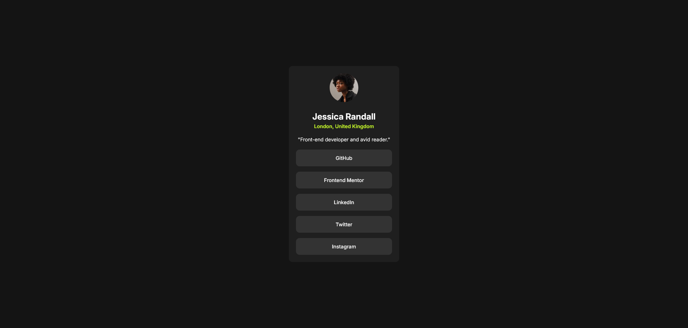
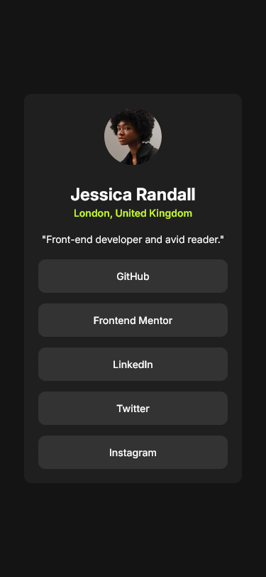

# Frontend Mentor - Social links profile solution

This is a solution to the [Social links profile challenge on Frontend Mentor](https://www.frontendmentor.io/challenges/social-links-profile-UG32l9m6dQ). Frontend Mentor challenges help you improve your coding skills by building realistic projects.

## Table of contents

- [Overview](#overview)
  - [The challenge](#the-challenge)
  - [Screenshot](#screenshot)
  - [Links](#links)
- [My process](#my-process)
  - [Built with](#built-with)
  - [What I learned](#what-i-learned)
  - [Continued development](#continued-development)
- [Author](#author)

## Overview

### The challenge

Users should be able to:

- See hover and focus states for all interactive elements on the page

### Screenshot

### Links

- Solution URL: [Solution](https://www.frontendmentor.io/solutions/mobile-first-social-links-profile-vCrIvSLx7k)
- Live Site URL: [Live Site](https://beautiful-mooncake-e76688.netlify.app/)

## My process

I start by writing HTML element so i can start to design it using CSS. I use mobile-first workflow so that it easily scale to desktop view. I use class name with prefix profile because it looks related. I use CSS custom properties to set variable for color, using CSS reset, setting the html font to 62.5% to easily calculate it using `rem`. I use `min-height` in the body to make sure the height will not go lower than 100vh. For profile image, i use `max-width` and `max-height` of 30% to so the image size will not go beyond 30% of it's size. in skill block, i use `not` pseudo class targeting `first-child` in order to not set margin-top on the first child of element.

### Built with

- Semantic HTML5 markup
- CSS custom properties
- Flexbox
- Mobile-first workflow

### What I learned

I learn that instead of using height of 100vh i can use `min-height` of 100vh. the min-height will ensure it will not go lower than 100vh.

### Continued development

There is one more challenge in getting started on frontendmentor to complete. as of right now not a lot of thing i can develop. i focus on practice

## Author

- Frontend Mentor - [@Odiesta](https://www.frontendmentor.io/profile/Odiesta)
- X - [@OdiestaS](https://x.com/OdiestaS)
